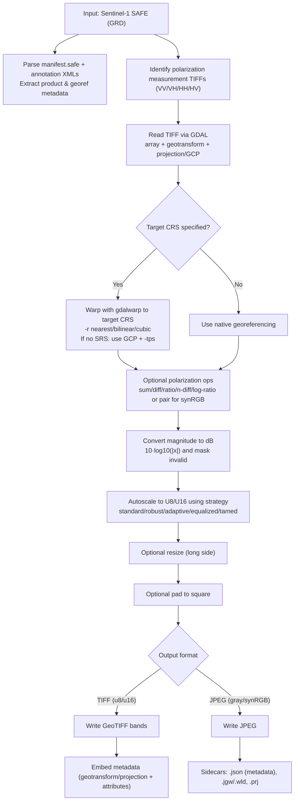

# SARPRO

A high-performance Sentinel-1 Synthetic Aperture Radar (SAR) GRD product to image processor written in Rust. SARPRO is designed for users and organizations who need fast, hassle-free processing of Sentinel-1 GRD products into GeoTIFF or JPEG formats, delivering excellent grayscale GeoTIFFs and grayscale or synthetic RGB JPEGs with minimal setup time.

## Features
- **Sentinel-1 Support**: Specialized for Sentinel-1 SAR GRD products
- **Multiple Interfaces**: CLI, GUI, and library APIs
- **Blazing Fast Performance**: Process dual-band 400MP GRD product images and scale to 4MP (2048x2048) synthetic RGB JPEG with reprojection and padding in just **~1.5 seconds** on modern laptops (since v0.2.1, see [CHANGELOG](CHANGELOG.md) for performance details) **THIS IS NOT A TYPO**
- **Flexible Polarization**: Support for VV, VH, HH, HV, multiband, and polarization operations (sum, difference, ratio, etc.)
- **Advanced Autoscaling**: Multiple strategies including standard, robust, adaptive, and equalized
- **Batch Processing**: Process multiple SAFE directories efficiently for ML workflows
- **Output Formats**: TIFF and JPEG support with configurable bit depths
- **Memory Efficient**: Optimized for processing large SAR datasets
- **I/O Optimized**: Performance typically limited by disk I/O, not CPU processing
- **since v0.2.0**: Can now reproject to any CRS and resample with nearest, bilinear, cubic, or lanczos algorithms
- **since v0.3.0**: Can now automatically detect the target CRS from the product metadata and use it for reprojection.

## ROADMAP and ROADMAP_explained
See [ROADMAP.md](ROADMAP.md) for the high‑level phases and upcoming features. See [ROADMAP_explained.md](ROADMAP_explained.md) for the detailed technical explanation. This highlights what’s coming (COG/STAC, masking, speckle filters, DEM‑based RTC, tiling, time‑series) and expected release groupings.

*Note 1: The ROADMAP and its technical explanation might change at any moment prioritizing some features over others or adding new ones and slicing some out. Yet it was created to be a minimal-refactor plan and as orgranic as possible, though not a contract.*

*Note 2: The ROADMAP and its technical explanation can have mistakes and knowledge gaps which as my understanding of the project deepens will be eliminated or treated as opinionated.*

## CHANGELOG
Visit [CHANGELOG.md](CHANGELOG.md) to track the changes. 

## Best Usage Practices

### What SARPRO Can Do Now

- **Convert Sentinel‑1 GRD .SAFE to map‑ready GeoTIFFs (u8/u16)**: Single‑band VV/VH/HH/HV or dual‑band multiband TIFFs with embedded geotransform/projection. Optional reprojection to a target CRS (e.g., `EPSG:4326`, `EPSG:32633`) with `--target-crs` and resampling (`--resample-alg nearest|bilinear|cubic|lanczos`).
- **Produce high‑quality quicklooks (JPEG) with sidecars**: Grayscale or synthetic RGB JPEGs, plus `.json` metadata, `.jgw/.wld` worldfile, and `.prj` projection. Great for catalogs and reports.
- **Generate synthetic RGB from dual‑pol scenes**: Combine co‑pol and cross‑pol pairs (VV+VH or HH+HV) into visually compelling composites for exploration and communication.
- **Run polarization math for feature exploration**: Output SAR‑specific gray products from `sum`, `diff`, `ratio`, `n-diff`, and `log-ratio` on available pairs (VV/VH or HH/HV) to emphasize scattering differences.
- **Batch‑process folders of SAFE robustly**: Convert many products in one run with `--batch` and `--input-dir/--output-dir`, continue on errors, and get per‑run summaries.
- **Downsample huge rasters on read efficiently**: Read bands directly at the requested output size (long‑side `--size`), minimizing I/O and memory. Choose resampling quality; Lanczos and Average are used appropriately when shrinking (v0.2.3+).
- **Resize/pad to consistent shapes for ML**: Standardize outputs to 512/1024/2048 (or custom) and `--pad` to square for CNN‑friendly datasets.
- **Preserve native geometry when needed**: Skip reprojection with `--target-crs none` to avoid any resampling (better for quantitative pixel comparisons and downstream co‑registration pipelines).
- **Embed and export georeferencing correctly**: TIFFs carry affine transform and projection; JPEGs ship with world/projection files and JSON metadata.
- **Use a GUI for local, interactive runs**: Select SAFE folders, tweak parameters, monitor progress, and auto‑generate equivalent CLI commands.
- **Integrate as a Rust library**: Call the typed API to get in‑memory buffers or write outputs directly from your application, reusing SARPRO’s autoscaling and writers.

Where SARPRO v0.2.4 fits today (GRD):
- **Exploratory analysis and visualization**: Rapidly turn SAFE into publication‑quality figures and synRGB quicklooks for urban, agriculture, water, and disaster contexts.
- **Internal data catalogs**: Generate standardized JPEG quicklooks and GeoTIFFs with consistent sizing for fast browsing and indexing.
- **ML dataset preparation**: Create reproducible grayscale or multiband inputs with fixed sizes/padding, ready for training/evaluation.
- **Map overlays and GIS**: Reproject to a target CRS for drop‑in alignment in QGIS or web maps; or keep native geometry for quantitative pipelines.
- **Polarization‑based feature engineering**: Produce ratio/log‑ratio/n‑diff layers to prototype features for downstream models.

### When to Use Each Interface

- **CLI**: Ideal for server environments and remote processing. Perfect for batch processing large datasets ready for machine learning workflows. Connect remotely and process images in bulk with consistent, automated results.

- **GUI**: Best for local work and interactive processing. Use when you need visual feedback, parameter experimentation, or one-off processing tasks on your local machine.

- **Library**: For experimentation and when you need direct access to core processing functions. Integrate SARPRO capabilities into your own Rust applications.

### Performance Expectations

SARPRO is optimized for bulk processing with exceptional performance:

- **Performance**: Starting from v0.2.1 dramatic optimizations were made to the processing pipeline which you can see in the [CHANGELOG](CHANGELOG.md). Now processing a dual-band 400MP SAR GRD product image and scaling it to 4MP (2048x2048) synthetic RGB JPEG with padding and reprojection takes approximately **~1.5 seconds** on a modern laptop (Apple M4Pro12) with Tamed db autoscale strategy and cubic resampling. Setting reprojection to `none` will reduce the time to **~348.21 ms**. And you might as well expect N x performance improvement in the cloud. Warping to the native resolution same dual-band 400MP SAR GRD product and into synthetic RGB JPEG takes x 12-14 or around **55 seconds**. Non warping on the same product peaks around **40 seconds**.
- **CPU vs I/O**: Debug and release builds show negligible performance differences on the latest Apple Silicon laptops, indicating that your performance will typically be **limited by I/O, not CPU**
- **Scalability**: Run multiple SARPRO or SARPRO UI instances in parallel — limited only by your system’s resources — to handle different workflows simultaneously.
- **Memory Usage**: The memory impact is staged sequentially.
- **Error Resilience**: The CLI and UI versions are made Error SAFE, which means it will not crash on errors (like no data available or data is corrupted, or wrong GRD product) no matter what.

#### Mount Fuji synthetic RGB crop example from the full 26544 × 26544px resolution processed by SARPRO in 50 seconds. Data: [dataspace.copernicus.eu](https://dataspace.copernicus.eu/) 
```Summary
Name: S1A_IW_GRDH_1SDV_20250706T204346_20250706T204411_059968_07730F_F70D.SAFE
Size: 1893MB
Sensing time: 2025-07-06T20:39:57.839576
Platform short name: SENTINEL-1
Instrument short name: SAR
```


### Recommended Workflows

1. **ML Pipeline Preparation**: Use CLI batch mode to process large collections of Sentinel-1 data into consistent formats
2. **Quality Assessment**: Use GUI for initial data exploration and parameter tuning
3. **Custom Integration**: Use the library API for specialized processing chains or integration with existing systems

### About using reprojection or not
Setting reprojection to `--target-crs none` or ommiting it preserves native geometry just as it is packed in the SAFE product.

#### When native/no-reprojection is useful:  
- Quantitative workflows that avoid resampling:
    - Change detection/ratios on same-orbit, same-processing GRDs handled by an external co-registration/RDTC step.
    - Preserving radiometry/speckle statistics (no interpolation).
- Downstream processing that performs proper RDTC later (don’t warp twice).
- Performance/throughput and reproducibility of pixel values for ML feature engineering.
- Quicklooks where map-accurate alignment is not required.

## Requirements

### System Dependencies

SARPRO depends on GDAL (Geospatial Data Abstraction Library) for reading and processing geospatial data. This is the only critical dependency to install correctly.

#### macOS (using Homebrew)

```bash
# Install GDAL via Homebrew
brew install gdal

# Verify installation
gdalinfo --version
```

**Environment Variables Setup:**

After installing GDAL with Homebrew, you need to set up environment variables for the Rust build process:

```bash
# Add to your ~/.zshrc or ~/.bashrc
export GDAL_HOME=$(brew --prefix gdal)
export GDAL_INCLUDE_DIR=$GDAL_HOME/include
export GDAL_LIB_DIR=$GDAL_HOME/lib
export PKG_CONFIG_PATH=$GDAL_HOME/lib/pkgconfig:$PKG_CONFIG_PATH

# For Apple Silicon Macs, you might also need:
export LIBRARY_PATH=$GDAL_HOME/lib:$LIBRARY_PATH
export CPATH=$GDAL_HOME/include:$CPATH
```

#### Linux (Ubuntu/Debian)

```bash
# Install GDAL development packages
sudo apt update
sudo apt install libgdal-dev gdal-bin pkg-config

# Verify installation
gdalinfo --version
```

#### Other Platforms

For other platforms or custom installations, ensure:
- GDAL development headers are available
- `pkg-config` can find GDAL
- Set `GDAL_HOME`, `GDAL_LIB_DIR`, and `GDAL_INCLUDE_DIR` environment variables if needed

### Rust Toolchain

SARPRO requires Rust 2024 edition. Install Rust using [rustup](https://rustup.rs/):

```bash
curl --proto '=https' --tlsv1.2 -sSf https://sh.rustup.rs | sh
```

## Installation

### From Source

```bash
# Clone the repository
git clone https://github.com/bogwi/sarpro.git
cd sarpro

# Build the project
cargo build --release --features full

# The CLI binary will be available at target/release/sarpro
# The GUI binary will be available at target/release/sarproUI
```

### Via Cargo (prebuilt install)

```bash
# Install CLI only (default features)
cargo install sarpro

# Install GUI binary (requires GDAL and GUI deps)
cargo install sarpro --features gui --bin sarproUI
```

Note: Installing the GUI requires the GDAL runtime and GUI dependencies to be available on your system.

## Usage

### Command Line Interface (CLI)

The CLI provides powerful batch processing capabilities for SAR imagery, optimized for cloud environments and ML pipeline preparation. Perfect for remote processing and bulk operations.

#### Usage Examples

```bash

# Batch process a directory
cargo run --release --bin sarpro -- --input-dir /path/to/safe/directories --output-dir /path/to/output --batch --log --format jpeg --polarization multiband --size 1024 --autoscale tamed --target-crs EPSG:32630 --resample-alg bilinear

# Process a .SAFE file with specific parameters
cargo run --release --bin sarpro -- -i data.SAFE -o output.tiff \
    --polarization multiband \
    --format tiff \
    --bit-depth u16 \
    --size 1024 \
    --autoscale tamed \
    --target-crs EPSG:32630 \
    --resample-alg bilinear \
    --log
```

#### Available Options

- `--input, -i`: Input SAFE directory (single file mode)
- `--input-dir`: Input directory containing SAFE subdirectories (batch mode)
- `--output, -o`: Output filename (single file mode)
- `--output-dir`: Output directory for batch processing
- `--format, -f`: Output format (`tiff` or `jpeg`)
- `--bit-depth`: Output bit depth (`8` or `16`)
- `--polarization`: Polarization mode (`vv`, `vh`, `hh`, `hv`, `multiband`, `sum`, `diff`, `ratio`, `n-diff`, `log-ratio`)
- `--autoscale`: Autoscaling strategy (`standard`, `robust`, `adaptive`, `equalized`, `tamed`, `default`)
- `--size`: Output image size (predefined: 512, 1024, 2048, or custom number, or `original`)
- `--pad`: Add padding to make square images
- `--batch`: Enable batch mode with error resilience
- `--log`: Enable detailed logging

- `--target-crs`: Optional target CRS for map reprojection (e.g., `EPSG:4326`, `EPSG:32633`). Special values: `auto` (detect UTM zone from metadata), `none` (disable reprojection)
- `--resample-alg`: Resampling algorithm for reprojection (`nearest`, `bilinear`, `cubic`) — default: `bilinear`

### Graphical User Interface (GUI)

Launch the GUI application for interactive local processing and experimentation:

- Start the GUI from the command line:

```bash
cargo run --release --bin sarproUI --features gui
```
or double click the executable here: `target/release/sarproUI` if you have built the project with the `full` feature.

The GUI is ideal for local work and provides:
- File browser for selecting SAFE directories
- Interactive parameter adjustment
- Real-time preview and visual feedback
- Progress monitoring
- Export/import of configuration presets
- CLI command generation
- TRACE, DEBUG, INFO, WARN, ERROR, logging levels
- System CPU and memory usage monitoring

### Screenshots and examples

#### SARPRO GUI

The GUI is the easiest way to get started with SARPRO locally.


#### Render example of Sentinel-1 SAR GRD product downloaded from [dataspace.copernicus.eu](https://dataspace.copernicus.eu/). The 25192 × 19614px (~500MP) reprojected, dual-band image scaled and padded to 3024px on the long side and carrying metadata took just ~2 seconds on Apple M4Pro12 with minimal CPU usage. (see [CHANGELOG](CHANGELOG.md) from v0.2.1 for performance details). Warping it at 25192 × 19614px, and autocaling, padding and into synthetic RGB JPEG takes around 70 seconds.
```Summary
Name: S1C_IW_GRDH_1SDV_20250730T142348_20250730T142417_003451_006EEA_895D.SAFE
Size: 1893MB
Sensing time: 2025-07-30T14:23:48.452000Z
Platform short name: SENTINEL-1
Instrument short name: SAR
```

#### Synthetic RGB
Create good lookers using synthetic RGB JPEGs in a few clicks. 


#### Multiband
Get what you need in classic multi-band Grayscale TIFFs, quickly.


### As a Library

SARPRO provides a typed, ergonomic Rust API for integrating Sentinel-1 GRD processing into your applications. The API is built on top of the working MVP used by the CLI/GUI and is robust, but still early and may evolve.

Note on stability: the public API is experimental in initial releases. Expect incremental improvements as the project stabilizes. Breaking changes may occur; consult the changelog and docs.

#### Add dependency

```toml
[dependencies]
sarpro = { version = "0.1", features = ["full"] }
```

#### High-level processing to a file

```rust
use std::path::Path;
use sarpro::{
    api::process_safe_to_path,
    ProcessingParams,
    AutoscaleStrategy, BitDepthArg, OutputFormat, Polarization,
};

let params = ProcessingParams {
    format: OutputFormat::TIFF,
    bit_depth: BitDepthArg::U16,
    polarization: Polarization::Multiband,
    autoscale: AutoscaleStrategy::Tamed,
    size: Some(2048),
    pad: true,
};

process_safe_to_path(
    Path::new("/data/S1A_xxx.SAFE"),
    Path::new("/out/product.tiff"),
    &params,
)?;
```

#### In-memory processing to raw buffers

```rust
use std::path::Path;
use sarpro::{
    api::process_safe_to_buffer,
    AutoscaleStrategy, BitDepth, OutputFormat, Polarization,
};

let img = process_safe_to_buffer(
    Path::new("/data/S1A_xxx.SAFE"),
    Polarization::Multiband,
    AutoscaleStrategy::Tamed,
    BitDepth::U8,            // Controls buffer bit depth for TIFF paths
    Some(1024),              // Resize target
    true,                    // Pad to square
    OutputFormat::JPEG,      // JPEG for synthetic RGB; TIFF for grayscale/multiband
)?;

match (img.format, img.bit_depth) {
    (OutputFormat::JPEG, _) => {
        // Synthetic RGB (interleaved RGB u8)
        let rgb: &[u8] = img.rgb.as_ref().unwrap();
        // Use in your pipeline...
    }
    (OutputFormat::TIFF, sarpro::BitDepth::U8) => {
        // Single-band or multiband u8
        let band1 = img.gray.as_ref();
        let band2 = img.gray_band2.as_ref();
    }
    (OutputFormat::TIFF, sarpro::BitDepth::U16) => {
        // Single-band or multiband u16
        let band1 = img.gray16.as_ref();
        let band2 = img.gray16_band2.as_ref();
    }
}
```

#### Typed save helpers (when you have complex arrays already)

```rust
use std::path::Path;
use ndarray::Array2;
use num_complex::Complex;
use sarpro::{
    api::{save_image, save_multiband_image},
    AutoscaleStrategy, BitDepth, OutputFormat, ProcessingOperation,
};

fn save_single(processed: &Array2<Complex<f64>>) -> sarpro::Result<()> {
    save_image(
        processed,
        Path::new("/out/single.tiff"),
        OutputFormat::TIFF,
        BitDepth::U16,
        Some(2048),
        None,                  // Optional SAFE metadata if available
        true,
        AutoscaleStrategy::Tamed,
        ProcessingOperation::SingleBand,
    )
}

fn save_dual(vv: &Array2<Complex<f64>>, vh: &Array2<Complex<f64>>) -> sarpro::Result<()> {
    save_multiband_image(
        vv,
        vh,
        Path::new("/out/multiband.tiff"),
        OutputFormat::TIFF,
        BitDepth::U8,
        Some(1024),
        None,
        true,
        AutoscaleStrategy::Tamed,
        ProcessingOperation::MultibandVvVh,
    )
}
```

#### Batch helpers

```rust
use std::path::Path;
use sarpro::{api::{iterate_safe_products, process_directory_to_path}, ProcessingParams, AutoscaleStrategy, BitDepthArg, OutputFormat, Polarization};

let params = ProcessingParams {
    format: OutputFormat::JPEG,
    bit_depth: BitDepthArg::U8,
    polarization: Polarization::Multiband,
    autoscale: AutoscaleStrategy::Tamed,
    size: Some(1024),
    pad: true,
};

let report = process_directory_to_path(
    Path::new("/data/safe_dir"),
    Path::new("/out"),
    &params,
    true, // continue_on_error
)?;

println!("processed={}, skipped={}, errors={}", report.processed, report.skipped, report.errors);
```

## Supported Data

- **Input Formats**: Sentinel-1 SAFE directories (GRD products)
- **Polarizations**: VV, VH, HH, HV, and combinations
- **Product Types**: Ground Range Detected (GRD)
- **Output Formats**: GeoTIFF, JPEG

## Product assumptions and processing pipeline

### What official Sentinel‑1 GRD already includes

- Radiometric calibration: Yes — DN values are converted to backscatter coefficients (σ⁰/β⁰/γ⁰) in ESA’s GRD chain
- Thermal noise removal: Yes — applied since IPF 2.9 (2018+)
- Multilooking & ground‑range projection: Yes — GRD is multilooked and in ground‑range geometry
- Range‑Doppler Terrain Correction (orthorectification): No — GRD remains in radar geometry without RDTC

### What SARPRO does and does not do

- SARPRO does not perform RDTC/orthorectification or DEM‑based terrain correction
- Optional map reprojection: If `--target-crs` is set, SARPRO uses GDAL `gdalwarp` to reproject using the product’s georeferencing (and falls back to GCP + `-tps` if needed). This improves map alignment in many cases but is not a substitute for full RDTC
- Core image steps: magnitude→dB conversion, SAR‑tuned autoscaling, optional resize/pad, then write GeoTIFF or JPEG with metadata. TIFF embeds georeferencing; JPEG is accompanied by `.json`, `.jgw/.wld`, and `.prj` sidecars

### Processing flow



## Troubleshooting (GDAL)

- If the build fails to find GDAL, ensure `pkg-config` locates it (`pkg-config --libs gdal`) and the environment variables in this README are exported in your shell.
- On macOS, confirm `brew --prefix gdal` resolves and paths are set for both compile and runtime (`DYLD_LIBRARY_PATH` may also be needed when running outside Cargo).
- On Linux, verify `libgdal-dev` and `gdal-bin` are installed and the GDAL version is supported by the crate.

## License

This project is dual-licensed under MIT OR Apache-2.0.

## Support

- **Issues**: [GitHub Issues](https://github.com/bogwi/sarpro/issues)
- **Documentation**: [docs.rs/sarpro](https://docs.rs/sarpro)

## Acknowledgments

SARPRO is built with:
- [GDAL](https://gdal.org/) for geospatial data processing
- [ndarray](https://github.com/rust-ndarray/ndarray) for numerical computing
- [eframe](https://github.com/emilk/egui) for the GUI
- [clap](https://github.com/clap-rs/clap) for command-line parsing
