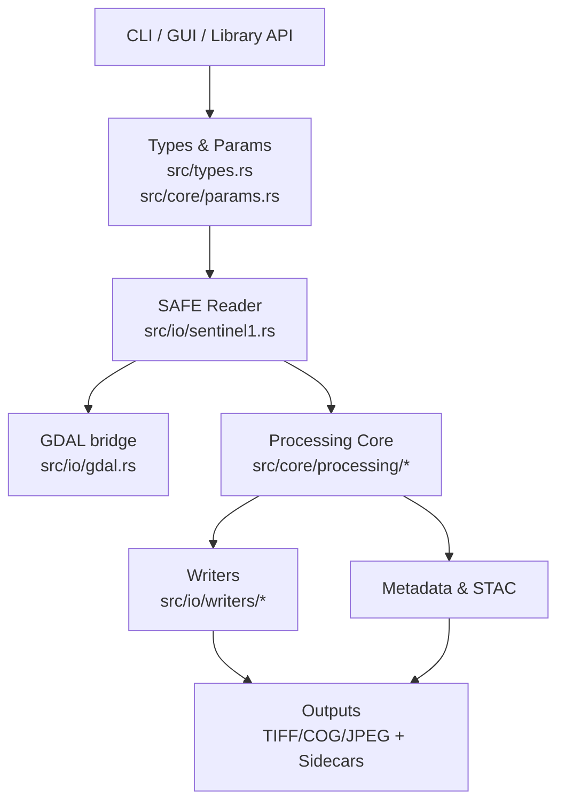
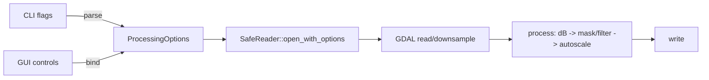
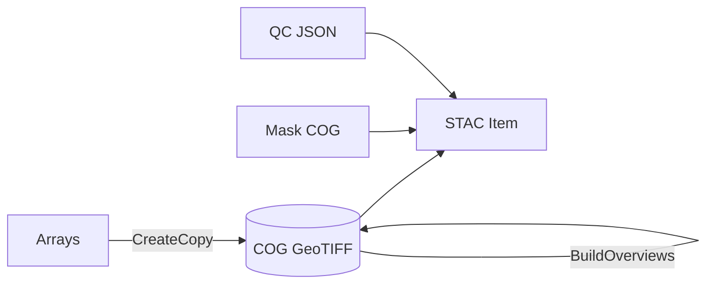
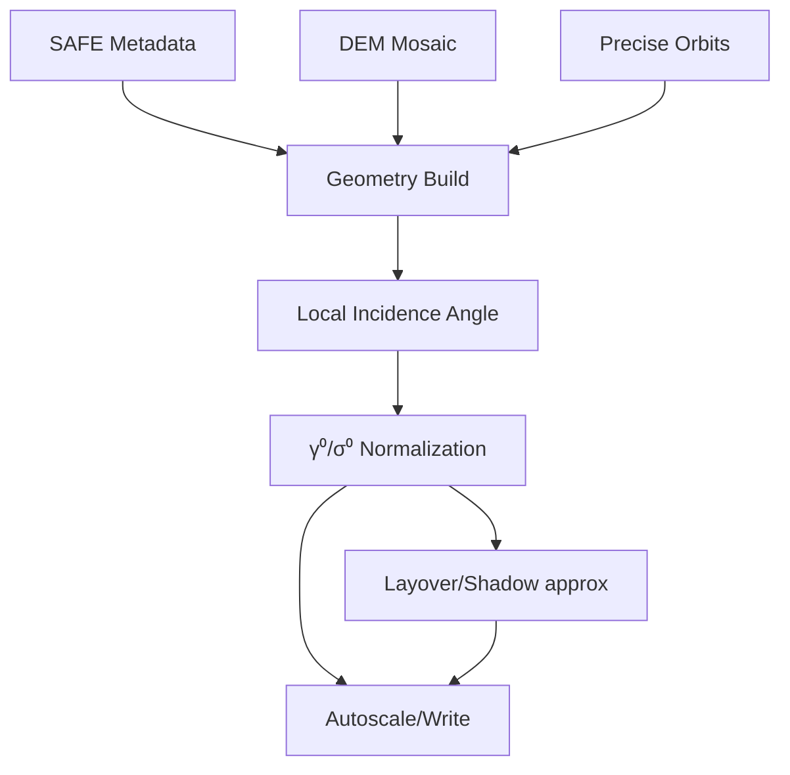

## SARPRO Roadmap — Explained for Developers

This document is your narrative, technical companion to the public `ROADMAP.md`. It is written to be a satisfying, end‑to‑end read for engineers joining SARPRO, whether you are new to Synthetic Aperture Radar (SAR) or a seasoned geospatial developer. Expect deep implementation notes, references to specific modules, performance guardrails, and diagrams that show how pieces fit together.

Key references:
- Public roadmap: `ROADMAP.md`
- Release history and performance notes: `CHANGELOG.md`

### Vision in one paragraph
SARPRO is a high‑performance Sentinel‑1 GRD processor that turns .SAFE products into production‑ready imagery and analysis‑ready data (ARD): fast COGs with overviews, validated STAC metadata, optional DEM‑based RTC and angular normalization, scalable tiling for ML, and turnkey time‑series change products. All of that with a clean Rust core, thin GDAL integration, and a great developer experience for local and cloud.

---

## Architecture at a glance

The system is split into a lean I/O and geometry layer (GDAL‑backed), a SAR‑aware processing core, and thin CLIs/GUI wrappers. This structure keeps costly geospatial operations in GDAL where it shines, and all SAR‑specific math and orchestration in clear, testable Rust.

Core processing path (today):
1) Read measurement band(s) via GDAL → 2) magnitude→dB → 3) optional mask/filter → 4) autoscale (histogram O(N)) → 5) optional resize/pad → 6) write TIFF/COG/JPEG + metadata sidecars.

Performance anchors:
- Downsample‑on‑read and single‑warp with `-ts` keep I/O low (see 0.2.1‑0.2.2 in `CHANGELOG.md`).
- Histogram‑based autoscale avoids materializing and sorting all values (see 0.2.4).

---

## Phases — the story of becoming ARD‑first

Each phase is incremental, optional by flags, and keeps the fast path intact. Defaults preserve current behavior; new features are opt‑in.

### Phase 1 — Foundations, options plumbing, remote I/O (VSICURL), STAC‑in

Why first: If we plumb options and remote access up front, all future features piggy‑back without repeated CLI/GUI churn.

What we add:
- A unified `ProcessingOptions` aggregate threaded from CLI/GUI to the core:
  - `RtcOptions { enabled, mode: gamma0|sigma0, dem, orbit }`
  - `MaskOptions { border, nesz_threshold, incidence_minmax, layover_shadow }`
  - `FilterOptions { method: none|lee|refined-lee|kuan|frost, window, strength }`
  - `TilingOptions { enabled, grid: webmercator|utm, z, size_px, overlap_px }`
  - `CogOptions { enabled, block: (x,y), compress: deflate|zstd|lzw, predictor, overviews }`
  - `StacOptions { in_path, out }`
  - `IoOptions { remote, cache_dir }`

Implementation sketch:
- Extend `src/types.rs` or `src/core/params.rs` with these structs. Keep the public flags as they are today; map them into `ProcessingOptions` internally.
- Wire through `src/cli/args.rs`, `src/cli/runner.rs`, `src/gui/models.rs`, `src/gui/processing.rs` to pass the aggregate down once.
- Remote I/O: allow `vsicurl` and HTTP inputs for measurement TIFFs in `src/io/gdal.rs` and `src/io/sentinel1.rs`. GDAL handles ranged reads; our job is path resolution.
- Add cache roots: `~/.sarpro/data/{dem,orbits}` and `~/.sarpro/cache`. Keep a small JSON index for provenance and cleanup.
- STAC‑in: parse a STAC Item and resolve asset HREFs into actual SAFE paths/URLs. Use `serde_json`; we only need minimal `proj/eo/sar` for now.

Pitfalls & tips:
- `vsicurl` needs absolute HREFs; avoid mixing local/remote in one product unless GDAL can transparently resolve.
- Always keep “no reprojection” as the default to preserve radiometry for ML.
- Plan for options to be serializable for reproducibility.

Success criteria:
- One options struct threaded end‑to‑end.
- Remote SAFE read works on real CDSE assets.
- STAC‑in loads a product by Item.

---

### Phase 2 — COG output + overviews, STAC‑out, QC JSON sidecar, official Docker image

Why now: COG and STAC are foundational for downstream tooling, cloud, and web. Putting them early avoids revisiting writers later. QC JSON and Docker make runs reproducible and portable.

COG engineering:
- Use GTiff CreateCopy with:
  - `TILED=YES`, `BLOCKXSIZE/BLOCKYSIZE` (e.g., 512×512 or 256×256)
  - `COMPRESS=DEFLATE|ZSTD` (ZSTD gives better speed/ratio on Apple Silicon)
  - `PREDICTOR=2` for integers (matches dB autoscaled outputs)
  - `BIGTIFF=YES` when needed
- Build overviews (`BuildOverviews`) using `AVERAGE` (intensity) or `GAUSS`. For categorical masks, use `NEAREST`.
- Preserve geotransform and projection after `resize/pad` by updating affine transform (already implemented in writers).

STAC‑out:
- Write a STAC Item adjacent to the output (`.json`) containing:
  - `proj` (bbox, centroid, epsg, transform), `eo` as needed, `sar` for acquisition details, links to COG and sidecars
  - Optional assets for masks and QC report

QC JSON sidecar:
- Emit `*.qc.json` capturing:
  - Autoscale strategy and percentile spans
  - Chosen resampler, target size, padding
  - Mask coverage stats, thresholds
  - RTC mode and DEM/orbit sources (when enabled)
  - Processing timings, input identifiers, software version

Official Docker image:
- Publish a pinned image (GHCR) that contains `sarpro`, `gdalinfo`, and matching GDAL runtime
- Provide entrypoints for CLI; GUI optional (X11/Wayland forwarding is user‑managed)

Success criteria:
- `gdalinfo --json` confirms COG tiling and overviews.
- STAC validator passes; COG opens instantly in QGIS and web viewers.
- Docker image runs the sample commands from `README.md`.

---

### Phase 3 — Quality & masking (baseline, DEM‑agnostic)

Purpose: Deliver clean, consistent outputs by default while keeping options opt‑in.

Masks to implement:
- Border/edge noise trim: fixed or auto (infer from tie‑point density or metadata)
- NESZ‑based noise mask: threshold in dB to clean low SNR regions
- Incidence angle range mask: keep pixels within `[min:max]` degrees when metadata supports it

Placement:
- Apply after dB conversion, before autoscale
- Propagate as nodata in TIFF; for JPEG, write `.jgw/.prj` and a JSON sidecar containing mask stats; emit a separate mask COG when `--cog` is enabled

Real‑world note: ESA SNAP often leaves it to users to mask border/thermal noise. Doing this in SARPRO saves downstream users from reinventing the wheel.

---

### Phase 4 — Speckle filters (fast, high‑quality options)

Goal: Provide standard filters tuned for speed and predictable visuals.

Algorithms:
- Lee (mean/variance adaptive)
- Refined Lee (edge‑preserving improvements)
- Kuan (multiplicative noise model)
- Frost (exponential kernel based on local variance)

Engineering placement:
- After dB and baseline mask; before autoscale
- Window sizes 3–7 px; optional multi‑scale

Performance strategies:
- Integral images for fast windowed stats
- Tiling to cap memory; optional Rayon for per‑row/strip parallelism

Reference: J.S. Lee, “Digital Image Smoothing and the Sigma Filter,” and subsequent refined Lee variants used widely in SAR literature.

---

### Phase 5 — DEM‑based RTC (Range‑Doppler Terrain Correction) and angular normalization

Why it matters: GRD is in radar geometry and not terrain‑corrected; RTC (with γ⁰/σ⁰ options) yields map‑accurate, radiometrically corrected backscatter suitable for quantitative analysis.

Key components:
- DEM providers: Copernicus GLO‑30 (30 m), SRTM; mosaic/crop to AOI; cache locally
- Orbits: precise orbit files retrieval and caching
- Geometry: compute local incidence angle from DEM + acquisition geometry; apply normalization to produce γ⁰/σ⁰
- Layover/shadow masks (approx in GRD): flag problematic terrain geometry

Execution model:
- Prefer single resampling: if warping, use `gdalwarp -of VRT -ts cols rows -r <alg>` and read the VRT directly
- If staying native, apply per‑pixel correction in array space using updated geometry

Pitfalls & references:
- Avoid double resampling; record the chosen path in QC JSON
- ASF HyP3 and ESA SNAP implement RTC; we aim for equivalent correctness with substantially higher throughput

---

### Phase 6 — Tiling/Chipping (for ML and web at scale)

Why: Massive scenes are unwieldy; ML workflows need chips; web needs tiles.

Features:
- Grid generators: WebMercator Z/X/Y; UTM fixed‑size (1 km/10 km) grids
- Overlap for data augmentation (e.g., 32–64 px)
- Nodata handling at tile edges; pad to full tiles as needed

Streaming design:
- Process tile‑by‑tile: read → mask/filter → RTC (optional) → autoscale → write COG chip and sidecars → STAC Item per tile
- Keep memory bounded; parallelize at the tile level if I/O allows

Naming & metadata:
- Pattern templates including product ID, grid coordinates, polarization
- Per‑tile STAC Item; optional Collection roll‑up

---

### Phase 7 — Time‑series stack + change products

Objective: Make robust change detection a flag away on GRD.

Stack builder:
- Ingest a directory/list of SAFE products; group by relative orbit/track and polarization
- Co‑register GRDs with sub‑pixel precision using intensity‑based correlation (phase‑free) and geometric hints
- Normalize intensities across time to reduce acquisition variability

Products:
- Pairwise: log‑ratio, normalized difference
- Temporal composites: median, temporal stddev, robust aggregations
- Optional despeckle during/after stacking

Outputs:
- COGs, masks, STAC Items; optionally tiles via Phase 6

---

### Phase 8 — Local preview server + visualization presets

Local XYZ server:
- Lightweight HTTP service (e.g., `axum`) that serves tiles from COGs
- Useful for instant validation and sharing on a LAN

Visualization presets:
- Copernicus‑style composites and autoscale recipes; `.qml` and JSON styles for GIS and web
- Integrated in GUI as presets for reproducible looks

---

## Developer guideposts

### Files and modules you’ll touch a lot
- Readers: `src/io/sentinel1.rs`, `src/io/gdal.rs`
- Processing: `src/core/processing/*` (autoscale, ops, resize, save)
- Writers/metadata: `src/io/writers/*` (tiff, jpeg, worldfile, metadata)
- CLI/GUI: `src/cli/*`, `src/gui/*`
- Types/params: `src/types.rs`, `src/core/params.rs`

### Performance playbook
- Prefer downsample‑on‑read and single‑warp `-ts` paths
- Avoid materializing full‑res intermediates when the target is smaller
- Keep histogram‑based autoscale hot; avoid O(N log N) sorts
- Tile for memory locality; avoid huge allocations; stream wherever possible

### Reproducibility & QC
- Record decisions (resampler, clips, thresholds, timings) in QC JSON
- Make options serializable; dump `ProcessingOptions` on request
- STAC Items should link to all relevant sidecars and the source(s)

### Testing strategy
- Golden tests in `test_data/` comparing against SNAP/HyP3 samples (tolerances defined per product)
- COG validity checks via `gdalinfo --json`
- Tiling coverage checks and overlap correctness
- Filter determinism tests and micro‑benchmarks

### Security & licensing
- Respect CDSE/Earthdata terms; cache responsibly
- Avoid embedding credentials; prefer env vars and secure stores

---

## Glossary (quick SAR primer)
- σ⁰/γ⁰: Backscatter coefficients; γ⁰ normalizes for incidence angle effects
- RTC: Terrain correction to map geometry using DEM and acquisition geometry
- NESZ: Noise‑Equivalent Sigma Zero; used to mask low‑SNR regions
- COG: Cloud Optimized GeoTIFF; tiled GeoTIFF that supports HTTP range reads
- STAC: SpatioTemporal Asset Catalog; JSON metadata standard for geospatial assets

